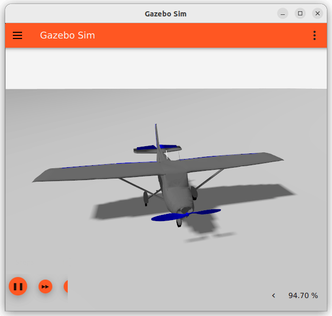

# Adaptive Sliding Mode (ASMC) Controller for Fixed Wing UAV

This repository contains the PID & ASMC controller for attitude and altitude control for fixed wing uav in PX4-GazeboSim.


## *Simulation Stack*
- ROS2
- Gazebo
- PX4
- QGroundController (Ground Station)

## *Simulated Vehicle*
The PID and ASMC controller was developed and fine tuned for the advanced plane model in the gazebo sim.

ASMC controller was employed to control the attitude of the vehicle and the PID controller was used to maintain the altitude of the vehicle.



## *Setup*
### **Prerequisites** 
Make sure to setup 
    - Docker 
    - Vscode with docker and devcontainer extensions

if you face any issue with nvidia card visit [this](https://github.com/Srindot/Waypoint_Tracking_in_ROS-PX4.git) repo for more information.


### **Usage** 
1. Clone this repository 
    ```bash 
    git clone https://github.com/Srindot/asmc-fixed-wing-controller.git
    ```

2. Open the project with vscode and make sure you install docker and devcontainer extensions.


3. Press `ctrl` + `SHIFT`+ `P` to open up the command pallete, then search for `Dev Containers: Rebuild and Reopen in Container` and select it. 
    > Note: This will take a long time, so no need to fret.

4. After entering container, press `ctrl` + `SHIFT`+ `P` again, then search for `Tasks: Run Tasks` and then run the sessions sequentially.


## *Issues*
If you face any troubles, just raise a issue. 